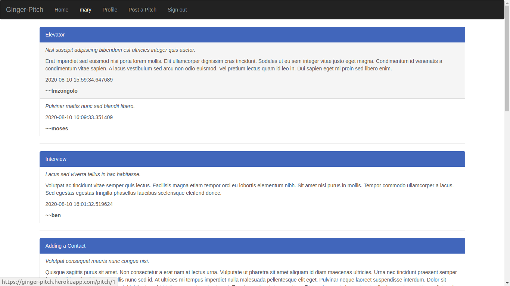
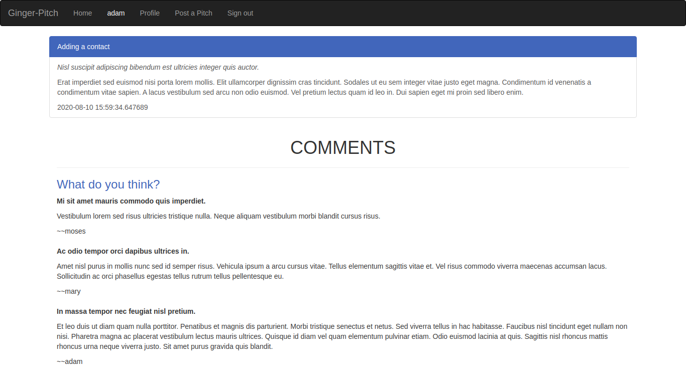
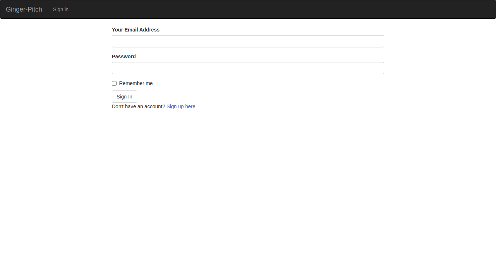
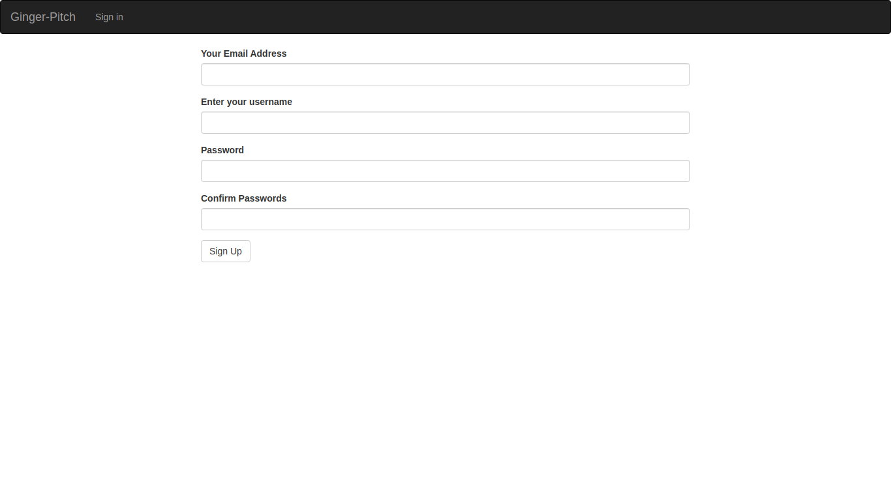
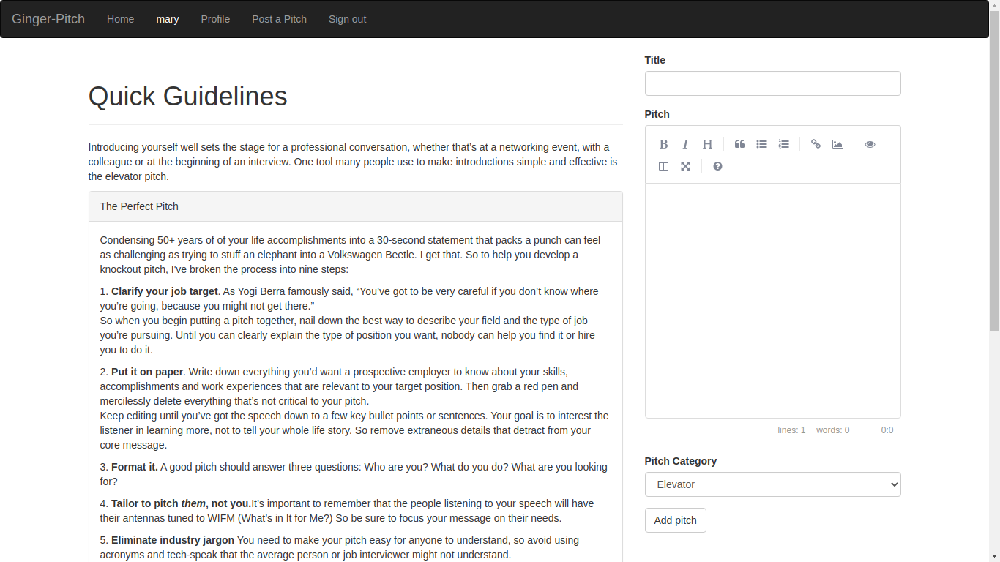
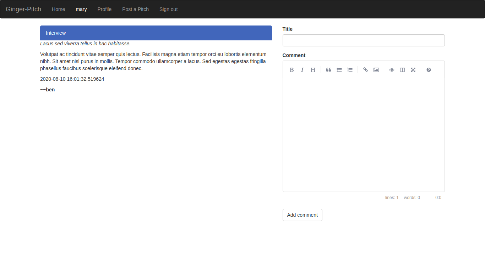

# Flask Ginger Pitch



In life, you only have 60 seconds to impress someone. 1 minute can make or break you. How do we make sure that you use your 1 minute to actually say something meaningful?

Flask Ginger Pitch is an application that allows users to use that one minute wisely. The users can submit their one minute pitches and other users can leave comments to give their feedback on them.

The pitches are organized by category. Flask Ginger Pitch offers the following categories:

- Elevator
- Interview
- Adding a contact
- Job opportunity
- Product pitch
- Promotional pitch

# BEHAVIOUR DRIVEN DEVELOPMENT
Behaviour                       |Input                        | Output                                     |
--------------------------------|-----------------------------|--------------------------------------------|
Ability to login to your account| Login button clicked        | Redirects the user to the login page       |
Ability to register new user    | Sign up button              | Redirects the user to the sign up page     |
Add pitch feature               | Post a pitch button clicked | Redirects the user to a page with a form   |
Show profile                    | Profile button clicked      | Redirects the user to his/her profile page |


# Demo
Here is a working live demo: https://ginger-pitch.herokuapp.com/

## Site
### Landing Page
The landing page displays all the pitches other people have posted. The pitches are organized by category.


### Specific pitch details page
This page displays a single pitch and it's comments.



### Login page
This page, provides a form that allows users to signin to the application



### Signup page
This page allows a user to create an account.



### Post a pitch page
This page allows a user to submit a pitch in any category.



### Comment on a pitch
This page provides a form that allows a user to leave a comment.



# Setup

## Application Requirements
1. Ensure you have [Python3.6](www://https://python.org) installed in your computer. You can run:
`sudo apt-get update && sudo apt-get install python3.6` to download.
2. Ensure you have [PiP](https://pypi.org/) in your computer. Run `python get-pip.py` to install.

Clone the repo to your desktop and run `pip install -r requirements.txt` to install all the dependencies.

# Usage
After you clone this repo to your desktop, go to its root directory and create `start.sh` file. Open `start.sh` file and add the following:

```
export SECRET_KEY="<your-secret-key-value>"
export SENDGRID_MAIL_USERNAME="<send-grid-email-address>"
export DATABASE_URL='postgresql+psycopg2://<database-username>:<database-password>@localhost/<name-of-database>'
export SENDGRID_API_KEY='<send-grid-api-key>'

python3.6 manage.py server

```

We now need to make `start.sh` file executable. Run the following commands:

```
chmod +x start.sh
```

```
sh start.sh
```

You can run the Flask server to start the application by running:
```
. start.sh
```
You will then be able to access it at http://127.0.0.1:5000/. 

## Development
Want to contribute? Great!

To fix a bug or enhance an existing module, follow these steps:

- Fork the repo
- Create a new branch (`git checkout -b improve-feature`)
- Make the appropriate changes in the files
- Add changes to reflect the changes made
- Commit your changes (`git commit -am 'Improve feature'`)
- Push to the branch (`git push origin improve-feature`)
- Create a Pull Request

## Bug / Feature Request
If you find a bug, kindly open an issue [here](https://github.com/lwairore/python-ginger-pitch/issues/new).

If you'd like to request a new function, fee free to do so by opening an issue [here](https://github.com/lwairore/python-ginger-pitch/issues/new).

# Technologies used
1. Pen and Paper - For mockup design.
1. [Flask](http://flask.pocoo.org/) - For both backend and fronted.
1. [Bootstrap](http://getbootstrap.com/) - For simple responsive UI elements.
1. [Coolors](https://coolors.co/) - For color scheme generation.

## GINGER Management Team 
### [Karangu Lucas Wairore](github.com/lwairore) 
####    Full-stack developer

MIT License

Copyright (c) 2019 Karangu Lucas Wairore
